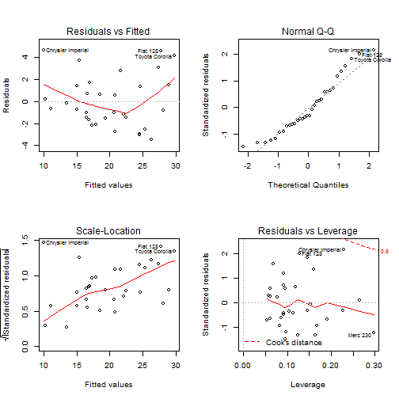

##"Motor Trend: Analysis MPG vs Transmission"


###1. Executive Summary
The objective of this report is to analyze if an automatic or manual transmission better for MPG for cars and if so, to quantify the MPG difference between the two models. For this the dataset mtcars was used, which was extracted from the 1974 Motor Trend US magazine. It comprises fuel consumption and 10 aspects of automobile design and performance for 32 automobiles (1973-74 models). From the analysis it is clear that Manual transmission is better than automatic, increasing mpg by 7.25 (95% confidence interval of (3.64, 10.85)) on a standalone basis. This increase drops to 2.94 mpg when considered with other variables, in a model in which all variables had signigicant t-statistic. 

###2. Exploratory Analysis
First pairwise plot the variables and also look at Correlation values. As in Figure 1 and correlation data, it looks like hp is correlated with (cyl, disp, vs, qsec) and wt with (cyl, disp, drat, hp). It looks like mpg has relationship with cyl, disp, hp, drat, wt, qsec, vs, am, gear and carb.


####Hypothesis Testing 
Perform a ttest to check mpg against transmission.The p-value is < 0.05 and 95% confidence interval (-11.28, -3.2) doesnot include 0. Hence Manual might have better MPG than Automatic, but this needs to explored in context of other variables.

###3.Model of MPG vs Transmission (Simple Linear Regression)
A boxplot of mpg vs AM, as shown in Figure 2, indicates a difference in means of MPG for the two variety of transmissions. It shows that manual cars have a better MPG than Automatic. A regression model of mpg vs AM is created as below. The confidence interval for Manual transmission is also generated.

```
##             Estimate Std. Error t value  Pr(>|t|)
## (Intercept)   17.147      1.125  15.247 1.134e-15
## amManual       7.245      1.764   4.106 2.850e-04
```

```
## [1] "Residual standard error: 4.9  Multiple R-squared: 0.36  Adjusted R-squared: 0.34 F-statistic: 16.86"
```

```
## [1] "95% Confidence Interval"
```

```
##          2.5 % 97.5 %
## amManual 3.642  10.85
```
The slope of AM is observed to be significant. As per the model, there is a 7.25 mpg increase in switch from Automatic to Manual transmission. The 95% confidence interval (3.64, 10.85) doesnot include 0. However, the adjusted R^2 is around 34%, and additional variables might need to be considered. 
###4. Model of MPG vs Multiple Variables (Multivariate Linear Regression)
First tried a model with all the variables included in  it. The VIF for some of the variables are high, indicating need to remove some variables due to multicolinearity. All probabilities are also not significant. 

Various other models were tried. The model with relatively high R-squared & Adj R-Squared and with significant p values for all variables also with VIF under control is shown below. Intutively Wt seemed to be correlated with all variables except qsec and AM had to be included in the model. 

```
##             Estimate Std. Error t value  Pr(>|t|)
## (Intercept)    9.618     6.9596   1.382 1.779e-01
## wt            -3.917     0.7112  -5.507 6.953e-06
## qsec           1.226     0.2887   4.247 2.162e-04
## amManual       2.936     1.4109   2.081 4.672e-02
```

```
## [1] "Residual standard error: 2.46  Multiple R-squared: 0.85  Adjusted R-squared: 0.83 F-statistic: 52.75"
```

```
## [1] "VIF"
```

```
##    wt  qsec    am 
## 2.483 1.364 2.541
```

```
## Analysis of Variance Table
## 
## Model 1: mpg ~ am
## Model 2: mpg ~ wt + qsec + am
##   Res.Df RSS Df Sum of Sq    F  Pr(>F)    
## 1     30 721                              
## 2     28 169  2       552 45.6 1.6e-09 ***
## ---
## Signif. codes:  0 '***' 0.001 '**' 0.01 '*' 0.05 '.' 0.1 ' ' 1
```
From the p-value of ANOVA test, the additions variables does improve the model compared to the simple regression model with just the transmission.

#### Residual Analysis
Residuals are plotted in Figure 3. We observe that residuals are normally distributed and homoskedastic.


###6. Conclusion
On a standalone basis, there is a 7.25 mpg increase in switch from Automatic to Manual transmission, but this model clearly showed that other factors were missing. Considering other parameters, the best fit model showed that the increase drops to 2.94 mpg increase in switch from Automatic to Manual transmission. 


###7. Appendix

```
## [1] "Figure 1: Pairwise plot of Variables"
```

 

```
## [1] "Figure 2: Plot mpg against AM"
```

 

```
## [1] "Figure 3: Residual Plot"
```

 
